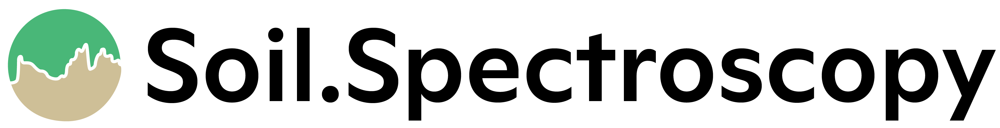

# Welcome! {.unnumbered}

Welcome to our training guide on **Predictive Soil Spectroscopy**! This material was first published for an in-person workshop held in St Louis, MO, at the [**ACS international meeting 2023**](https://www.acsmeetings.org/).

Now it is a live guide so that anyone can access and reuse it!

Soil spectroscopy, specifically [**Diffuse Reflectance Spectroscopy**](https://en.wikipedia.org/wiki/Diffuse_reflectance_infrared_Fourier_transform_spectroscopy), is rapidly becoming a routine tool for soil analysis in academia and in industry.

One of the most popular uses of soil spectroscopy is for the rapid and low-cost estimation of particle size distribution, carbon fractions, and clay minerals.

This guide touch on the basics of soil spectroscopy development including project design, considerations for building a spectral library, working with large and public spectral libraries, and predictive modeling.

Most of the learning will focus on using the free and open source [**R programming language**](https://www.r-project.org/about.html).

This material was updated with R version `4.5`, and it is recommended to use RStudio as the graphical user interface.

# Prerequisites {.unnumbered}

This training is mostly focused on the use of **tidy** programming principles with pipe operators, leveraging the R packages from the [**tidyverse**](https://www.tidyverse.org/) like **dplyr**, **tidyr**, and **ggplot2**.

For the machine learning framework, the first version of this guide was made with the [**MLR3**](https://mlr3book.mlr-org.com/) framework. However, we decided to switch to [**tidymodels**](https://www.tidymodels.org/) ecosystem as it has a simpler and more user-friendly interface.

Alternatively, we have included a chemometrics chapter where some common tools and algorithms for working with spectral data are introduced. This was possible with the availability of the amazing package [**mdatools**](https://mdatools.com/docs/index.html).

We do, however, recommend that you keep an eye on this online material as it may evolve in time and new methods may be incorporated.

If you are interested in getting started in R using tidy packages and principles, we strongly recommend checking the [**R 4 Data Science**](https://r4ds.had.co.nz/) book page:

- For installing R and RStudio, it is recommended to check the [**Prerequisites **](https://r4ds.had.co.nz/introduction.html#prerequisites) page.    
- Learning how to set a basic project on RStudio is neatly described in [**Workflow: projects**](https://r4ds.had.co.nz/workflow-projects.html).  
- We are going to have several demonstrations of data [**import**](https://r4ds.had.co.nz/data-import.html) and [**wrangling**](https://r4ds.had.co.nz/transform.html#transform) by piped operations, and plot visualizations with [**ggplot**](https://r4ds.had.co.nz/data-visualisation.html).  

Other spectral operations, like importing raw spectral files, preprocessing, compression, and modeling can be done with dedicated libraries, e.g., [**asdreader**](https://github.com/pierreroudier/asdreader), [**opusreader2**](https://spectral-cockpit.github.io/opusreader2/), [**prospectr**](https://cran.r-project.org/web/packages/prospectr/vignettes/prospectr.html), [**resemble**](https://cran.r-project.org/web/packages/resemble/vignettes/resemble.html), [**tidymodels**](https://www.tidymodels.org/), and many others.

# Recommended literature {.unnumbered}

Fundamentals of infrared spectroscopy are well presented in [Johnston & Aochi (2018)](https://doi.org/10.2136/sssabookser5.3.c10), [Stenberg & Viscarra-Rossel (2018)](https://doi.org/10.1007/978-90-481-8859-8_3), [Margenot et al. (2017)](http://dx.doi.org/10.1016/B978-0-12-409547-2.12170-5), [Pasquini (2003)](https://doi.org/10.1590/S0103-50532003000200006), while [Wadoux et al. (2021)](https://doi.org/10.1007/978-3-030-64896-1) dedicated a exclusive book with examples for soil spectral inference in R.

Some recommended reading:

- Johnston, C. T., & Aochi, Y. O. (2018). Fourier Transform Infrared and Raman Spectroscopy (pp. 269–321). <https://doi.org/10.2136/sssabookser5.3.c10>

- Stenberg, B., Viscarra-Rossel, R. (2010). Diffuse Reflectance Spectroscopy for High-Resolution Soil Sensing. In: Viscarra Rossel, R., McBratney, A., Minasny, B. (eds) Proximal Soil Sensing. Progress in Soil Science. Springer, Dordrecht. <https://doi.org/10.1007/978-90-481-8859-8_3>

- Margenot A.J., Calderón F.J., Goyne K.W., Mukome F.N.D and Parikh S.J. (2017) IR Spectroscopy, Soil Analysis Applications. In: Lindon, J.C., Tranter, G.E., and Koppenaal, D.W. (eds.) The Encyclopedia of Spectroscopy and Spectrometry, 3rd edition vol. 2, pp. 448-454. Oxford: Academic Press. <http://dx.doi.org/10.1016/B978-0-12-409547-2.12170-5>

- Pasquini, C. (2003). Near Infrared Spectroscopy: fundamentals, practical aspects and analytical applications. Journal of the Brazilian Chemical Society, 14(2), 198–219. <https://doi.org/10.1590/s0103-50532003000200006>

- Wadoux, A. M. J.-C., Malone, B., Minasny, B., Fajardo, M., & McBratney, A. B. (2021). Soil Spectral Inference with R. In Progress in Soil Science. Springer International Publishing. <https://doi.org/10.1007/978-3-030-64896-1>

- Ng, W., Minasny, B., Jeon, S. H., & McBratney, A. (2022). Mid-infrared spectroscopy for accurate measurement of an extensive set of soil properties for assessing soil functions. Soil Security, 6, 100043. <https://doi.org/10.1016/j.soisec.2022.100043>

- Shepherd, K. D., Ferguson, R., Hoover, D., van Egmond, F., Sanderman, J., & Ge, Y. (2022). A global soil spectral calibration library and estimation service. Soil Security, 7, 100061. <https://doi.org/10.1016/j.soisec.2022.100061>

- Safanelli, J. L., Hengl, T., Parente, L. L., Minarik, R., Bloom, D. E., Todd-Brown, K., Gholizadeh, A., Mendes, W. de S., & Sanderman, J. (2025). Open Soil Spectral Library (OSSL): Building reproducible soil calibration models through open development and community engagement. PLOS ONE, 20(1), e0296545. <https://doi.org/10.1371/journal.pone.0296545>

- Soil Spectroscopy for Global Good team. Open Soil Spectral Library. Available in <https://docs.soilspectroscopy.org/>.  <https://doi.org/10.5281/zenodo.5759693>

# Disclaimer {.unnumbered}

Woodwell Climate Research Center, University of Florida, OpenGeoHub foundation and its suppliers and licensors hereby disclaim all warranties of any kind, express or implied, including, without limitation, the warranties of merchantability, fitness for a particular purpose and non-infringement. Neither Woodwell Climate Research Center, University of Florida, OpenGeoHub foundation nor its suppliers and licensors, makes any warranty that the Website will be error free or that access thereto will be continuous or uninterrupted. You understand that you download from, or otherwise obtain content or services through, the Website at your own discretion and risk.

If you notice an error or outdated information, please submit a correction/pull request or open an issue.

# License

This website/book and attached software is free to use, and is licensed under the MIT License. The OSSL training data and models, if not otherwise indicated, are available either under the Creative Commons Attribution 4.0 International CC-BY and/or CC-BY-SA license / Open Data Commons Open Database License (ODbL) v1.0.

# Acknowledgments {.unnumbered}

[**Soil Spectroscopy for Global Good**](https://soilspectroscopy.org/) is organized by [**Woodwell Climate Research Center**](https://www.woodwellclimate.org/), [**University of Florida**](https://faculty.eng.ufl.edu/ktoddbrown/), and [**OpenGeoHub foundation**](https://opengeohub.org/). This project has been funded by the USDA National Institute of Food and Agriculture [award #2020-67021-32467](https://cris.nifa.usda.gov/cgi-bin/starfinder/0?path=fastlink1.txt&id=anon&pass=&search=R=89483&format=WEBFMT6NT).

# Citing

José Lucas Safanelli, Robert Minarik, Jonathan Sanderman, and Tomislav Hengl. Predictive Soil Spectroscopy. 2023. Available at: <https://soilspectroscopy.github.io/soilspec-workshop/>.

{fig-align="center" width="50%"}
