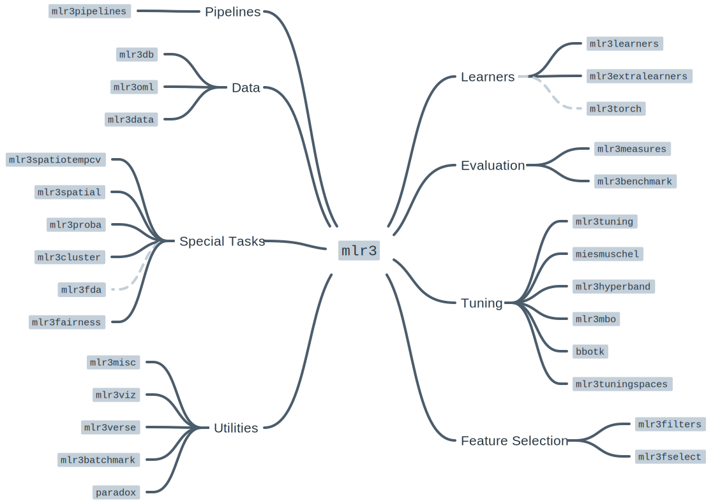

# Modeling

In this section, we introduce the modeling pipeline for estimating soil properties using soil NIR data. We will use the mlr3 modelling framework for modelling Soil Organic Carbon (SOC). We will train the predictive model trained on NIR spectra of US soil samples. We will test the model's generalization on African soil samples.

The mlr3 framework is well presented in Bischl, B., Sonabend, R., Kotthoff, L., & Lang, M. (Eds.). (2024). "Applied Machine Learning Using mlr3 in R". CRC Press. [**https://mlr3book.mlr-org.com**](https://mlr3book.mlr-org.com).

You can find a lot of interesting video tutorials on machine learning in [OpenGeoHub trining videos](https://av.tib.eu/publisher/OpenGeoHub_Foundation). 

## Introduction to mlr3 framework
We will introduce novel principles of the mlr3 framework using the first chapter of the official **mlr3 book** [**(Kotthoff et al., 2024)**](https://mlr3book.mlr-org.com/chapters/chapter1/introduction_and_overview.html). 

> (...) The **mlr3** package and the wider mlr3 ecosystem provide a generic, object-oriented, and extensible framework for regression, classification, and other machine learning tasks for the R language. (...) We build on R6 for object orientation and data.table to store and operate on tabular data. 

[](https://mlr3book.mlr-org.com/chapters/chapter1/Figures/mlr3_ecosystem.svg)

The most convenient way how to load the whole ecosystem is to load `mlr3verse` package.
```{r setup, message=FALSE, warning=FALSE}
#install.packages("mlr3verse")
#install.packages("readr")
library("readr")
library("mlr3verse")

#loading train and test data
train_matrix <- read_csv("~/robertm/opengeohub/neospectra_workshop/train.csv")
test_matrix <- read_csv("~/robertm/opengeohub/neospectra_workshop/test.csv")
```

**What is R6?**

> (...) [**R6**](https://cran.r-project.org/web/packages/R6/index.html) is one of R’s more recent paradigms for object-oriented programming.

**Objects** are created by constructing an instance of an [**R6::R6Class**](https://www.rdocumentation.org/packages/R6/versions/2.5.1/topics/R6Class) variable using the `$new()` initialization method. For example, say we have used a mlr3 class `TaskRegr`, then `TaskRegr$new(id = "NIR_spectral", backend = train_matrix, target = "oc_usda.c729_w.pct")` would create a new object of class `TaskRegr` and sets the `id` , `backend `and `target` **fields** that encapsulates mutable state of the object. 

Methods  allow users to inspect the object’s state, retrieve information, or perform an action that changes the internal state of the object. For example`$set_col_roles()` method sets the special roles such as ID or blocking during resampling to the columns.

```{r R6 object example, message=FALSE, warning=FALSE}
#creating an example object
example_object = TaskRegr$new(id = "NIR_spectral", 
                              backend = train_matrix, 
                              target = "oc_usda.c729_w.pct")
#access to the $id field
example_object$id
#calling methods of the object
example_object$set_col_roles("id.sample_local_c", role = "name")
example_object$set_col_roles("location.country_iso.3166_txt", role = "group")
example_object$col_roles
```
**mlr3 Utilities**

mlr3 uses convenience functions called **helper functions or sugar functions** to create most objects. For example `lrn("regr.rpart")` returns the decision tree learner without having to explicitly create a new R6 object.

mlr3 uses **dictionaries** to store R6 classes.  For example `lrn("regr.rpart")` is a wrapper around `mlr_learners$get("regr.rpart")`. You can see an overview of available learners by calling the sugar function without any arguments, i.e. `lrn()`.

## Inspecting data and a baseline model
Soil organic carbon (SOC) is a measurable component of soil organic matter. Organic matter makes up just a small part of soil's mass and has an important role in the physical, chemical and biological function of agricultural soils. SOC is represented in percent units (0-100%) and have a highly right skewed probability distribution, because SOC makes up just 2-10% of most soil's mass. The higher content is typical mainly for Organic soils i. e. peatbogs. Therefore SOC is oftenly modeled in a log-scale  to penalize the higher SOC content that is minor part of the data. Let's see if its is our case too. 
```{r histograms, message=FALSE, warning=FALSE}
hist(train_matrix$oc_usda.c729_w.pct, breaks = 100)
```
Yes, It is. So lets apply `log1p` function to SOC values of our train and test set. `log1p` function calculates natural logarithm of the values plus 1. 
```{r log1p, message=FALSE, warning=FALSE}
train_matrix$oc_usda.c729_w.pct = log1p(train_matrix$oc_usda.c729_w.pct)
test_matrix$oc_usda.c729_w.pct = log1p(test_matrix$oc_usda.c729_w.pct)
hist(train_matrix$oc_usda.c729_w.pct, breaks = 100)
```
It is a good practice to train a dummy model as a baseline to track the predictive power increment of our ML models. But lets first create our ML task using mlr3 syntax to follow the logic of the framework. 

We will use the convenient method `as_task_regr()` to convert data object to a `TaskRegr` class. We need to set argument `target` specifying our target variable and `id` of the task. We will also set special role `"name"` (Row names/observation labels) to the `"id.sample_local_c"` column. 
```{r task, message=FALSE, warning=FALSE}
set.seed(349)
# create task
task_neospectra= as_task_regr(train_matrix[,!names(train_matrix) %in% "location.country_iso.3166_txt"], 
                              target = "oc_usda.c729_w.pct", id = "NIR_spectral")
  #set row names role to the id.sample_local_c column 
task_neospectra$set_col_roles("id.sample_local_c", roles = "name")
task_neospectra
```

We will train the dummy model that always predicts new values to be the mean of the dataset. The dummy model is called `"regr.featureless"` in mlr3 dictionary. We can call `lrn("regr.featureless")` to create `Learner` class R6  object with no explicit programming.
```{r featureless baseline, message=FALSE, warning=FALSE}
# load featureless learner
  #featureless = always predicts new values to be the mean of the dataset
lrn_baseline = lrn("regr.featureless")
  #only one hyperparameter: robust =  calculate mean if false / calculate median if true
#lrn_baseline$param_set

# train learners using $train() method
lrn_baseline$train(task_neospectra)
```

We will calculate Root Mean Square Error (RMSE), Coefficient of determination (R2) and Mean absolute error (MAE) to assess the generalization error (prediction error, accuracy) of the model. 

> (...) RMSE is calculated as a square root of the mean of the squared differences between predicted and expected target values in a dataset. The units of the RMSE are the same as the original units of the target value that is being predicted. RMSE of the perfect match is 0. ([Regression Metrics for Machine Learning](https://machinelearningmastery.com/regression-metrics-for-machine-learning/#:~:text=There%20are%20three%20error%20metrics,Mean%20Absolute%20Error%20(MAE))).

> (...) R2, is the proportion of the variation in the dependent variable that is predictable from the independent variable(s). In the best case, the modeled values exactly match the observed values, which results in residual sum of squares 0 and R2 = 1. ([Coefficient of determination](https://en.wikipedia.org/wiki/Coefficient_of_determination)). A baseline model, which always predicts mean, will have R2 <= 0 when a non-linear function is used to fit the data ([Cameron & Windmeijer, 1998](https://www.sciencedirect.com/science/article/abs/pii/S0304407696018180?via%3Dihub)).

> (...) The MAE score is calculated as the average of the absolute error values. Absolute or `abs()` is a mathematical function that simply makes a number positive. Therefore, the difference between an expected and predicted value may be positive or negative and is forced to be positive when calculating the MAE. Unlike the RMSE, the changes in MAE are linear and therefore intuitive. ([Regression Metrics for Machine Learning](https://machinelearningmastery.com/regression-metrics-for-machine-learning/#:~:text=There%20are%20three%20error%20metrics,Mean%20Absolute%20Error%20(MAE))).

We will use `msrs` sugar function featuring mlr3 dictionary to create an object containing a list of class `Measures` objects `c("regr.rmse", "regr.rsq","regr.mae", "time_both")`.

```{r featureless baseline evaluation, message=FALSE, warning=FALSE}
set.seed(349)
#define metrics
measures = msrs(c("regr.rmse", "regr.rsq","regr.mae", "time_both"))
#predict on a new data using $predict_newdata() method
pred_baseline = lrn_baseline$predict_newdata(test_matrix)
#evaluation on the new data applying $score() method
pred_baseline$score(measures)
```

## Simple benchmarking
We have the baseline for now. So we can start selection of the best performing ML model. How does one selects the best performing model for a specific task? One can compare estimated generalization error (accuracy) of the models using a Cross-Validation (CV) when benchmarking. 

Benchmarking is easy in mlr3 framework thanks to predefined object classes, sugar functions and dictionaries. One has to define the set of learners for benchmarking using `lrns()` sugar function and dictionary of the learners. Second step is to define `Resample` object that encapsulates the CV. We will use 10-fold CV for now. 
```{r learners and cv for benchmarking, message=FALSE, warning=FALSE}
lrn_cv = lrns(c("regr.ranger", "regr.cv_glmnet", "regr.cubist"))
cv10 = rsmp("cv", folds = 10)
```

We can pass the both objects  to `benchmark_grid()` together with the task for constructing an exhaustive design to describe all combinations of the learners, tasks and resamplings to be used in a benchmark experiment. The benchmark experiment is conducted with `benchmark()`. The results are stored in the object of the  `BenchmarkResult` class. One can access the results of benchmarking applying `$score()` or `$aggregate()` methods on the object.  We can pass `Measures` object storing the selected metrics in the functions [Casalicchio & Burk, 2024](https://mlr3book.mlr-org.com/chapters/chapter3/evaluation_and_benchmarking.html#sec-benchmarking). 
```{r simple benchmarking, message=FALSE, warning=FALSE, results=FALSE}
bench_cv_grid = benchmark_grid(task_neospectra, lrn_cv, cv10)
bench_cv = benchmark(bench_cv_grid)
```

```{r simple benchmarking results, message=FALSE, warning=FALSE}
#see the results of each iteration using $score()
bench_cv$score(measures)[,.(learner_id, iteration, regr.rmse, regr.rsq, regr.mae, time_both)]
#see the aggregated results of the models using $aggregate()
bench_cv$aggregate(measures)[,.(learner_id, regr.rmse, regr.rsq, regr.mae)]
#using autoplot function to see RMSE boxplots
#autoplot(bench_cv, measure = msr("regr.rmse"))

# #predicting on test set using cubist model
# lrn_cubist = lrn("regr.cubist")
# lrn_cubist$train(task_neospectra)
# pred_cubist = lrn_cubist$predict_newdata(test_matrix)
# pred_cubist$score(measures)
```


## Simple tuning
> Machine learning algorithms usually include parameters and hyperparameters. Parameters are the model coefficients or weights or other information that are determined by the learning algorithm based on the training data. In contrast, hyperparameters, are configured by the user and determine how the model will fit its parameters, i.e., how the model is built The goal of hyperparameter optimization (HPO) or model tuning is to find the optimal configuration of hyperparameters of a machine learning algorithm for a given task. (...) [Becker et al., 2024](https://mlr3book.mlr-org.com/chapters/chapter4/hyperparameter_optimization.html). 

We will test simple model tuning of a [cubist model](https://cran.r-project.org/web/packages/Cubist/vignettes/cubist.html). We will search randomly for the best pair of `comitees` (a boosting-like scheme where iterative model trees are created in sequence) and `neighbors` (how many similar training points to use for determining the average of these training set points) hyperparameters.
```{r tune cubist model, message=FALSE, warning=FALSE, results=FALSE}
#define search spaces for committees and neighbors inside the Learner object using to_tune function
lrn_cubist = lrn("regr.cubist",
                 committees = to_tune(1, 20),
                 neighbors = to_tune(0, 5)
                 )
#define tuning instance using tune() helper function
  #tune() function will automatically calls $optimize() method of the instance
simple_tune = tune(
  method = "random_search", #picking random combinations of hyperparameters from the search space
  task = task_neospectra,
  learner = lrn_cubist,
  resampling = cv10, #apply 10-fold CV to calculate an evaluation metrics
  measures = msr("regr.rmse"), # use rmse metrics to select the best set of hyperparameters
  term_evals = 10 #terminate tuning after testing 10 combinations
)
```

```{r tune cubist model results, message=FALSE, warning=FALSE}
#exploring tuning results
simple_tune$result

# #create a new instance of the cubist model
# lrn_cubist_tuned = lrn("regr.cubist")
# #set best performing hyperparameters to the new instance
# lrn_cubist_tuned$param_set$values = simple_tune$result_learner_param_vals
# #train
# lrn_cubist_tuned$train(task_neospectra)
# #predict and evaluate
# pred_cubist_tuned = lrn_cubist_tuned$predict_newdata(test_matrix)
# pred_cubist_tuned$score(measures)
```

## Combining benchmarking and tuning
It is a standard to combine tuning and benchmarking, i. e. to benchmark tuned models, while searching for the best task specific model. **However, It is a good practice to implement nested resampling to get a really robust estimates of the generalization error.** It means to implement inner CV for tuning models and the outer CV to benchmark tuned models. We can implement it easily in mlr3 framework using the previous code and handy functions of mlr3 framework such as **predefined tuning spaces** and paraller processing. 

```{r showing tunig spaces, message=FALSE, warning=FALSE}
#showing dictionary of available pre-trained tuning spaces
as.data.table(mlr_tuning_spaces)[, .(label)]
```

```{r inner CV for tuning, message=FALSE, warning=FALSE, results=FALSE}
#selecting the spaces using sugar function ltss()
spaces = ltss(c("regr.ranger.default", "regr.glmnet.default")) #no availabe space for cubist

#creating list of learners and an empty list to write tuned learners
lrn_cv = lrns(c("regr.ranger", "regr.glmnet"))
lrn_cv_tuned = list()

#for loop to tune hyperparameters of every learner using random search
for (i in 1:length(lrn_cv)) {
  #using multiple cores for tuning each model
future::plan("multisession")
  instance = tune(
    task = task_neospectra,
    method = "random_search",
    learner = lrn_cv[[i]],
    resampling = cv10,
    measures = msr("regr.rmse"),
    term_evals = 10,
    search_space = spaces[[i]]
  )
  #writing tuned huperparameters
  lrn_cv_tuned[[i]] = lrn_cv[[i]]
  lrn_cv_tuned[[i]]$param_set$values = instance$result_learner_param_vals
}
#adding previously tuned cubist model to the list for benchmarking
  #create a new instance of the cubist model
lrn_cubist_tuned = lrn("regr.cubist")
  #set best performing hyperparameters to the new instance
lrn_cubist_tuned$param_set$values = simple_tune$result_learner_param_vals
lrn_cv_tuned = c(lrn_cv_tuned, lrn_cubist_tuned)
```

```{r outer CV benchmarking, message=FALSE, warning=FALSE, results=FALSE}
#creating benchmark grid
bench_cv_grid = benchmark_grid(task_neospectra, lrn_cv_tuned, cv10)
  #implementing bechmarking using multiple cores
future::plan("multisession")
  bench_cv = benchmark(bench_cv_grid)
```

```{r benchmarking results, message=FALSE, warning=FALSE}
#bench_cv$score(measures)[,.(learner_id, regr.rmse, regr.rsq, regr.mae)]
bench_cv$aggregate(measures)[,.(learner_id, regr.rmse, regr.rsq, regr.mae)]
```

We can see that the cubist model works best. So lets test the tuned cubist model on the test set. We can get the real generalization error of the best performing model by training a new model instance on the whole dataset and calculating error metrics on the test set. 
```{r final cubist model, message=FALSE, warning=FALSE}
lrn_cubist_tuned = lrn("regr.cubist")
lrn_cubist_tuned$param_set$values = lrn_cv_tuned[[3]]$param_set$values
lrn_cubist_tuned$train(task_neospectra)
pred_cubist_tuned = lrn_cubist_tuned$predict_newdata(test_matrix)
pred_cubist_tuned$score(measures)
```

