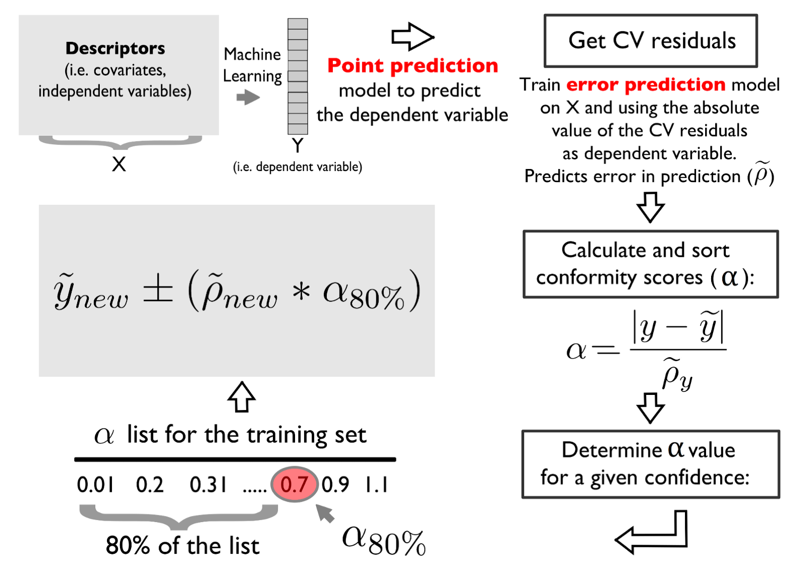

# Modeling

In this section, we introduce the modeling pipeline for estimating soil properties using soil NIR data. We will use the **mlr3** framework for modeling Soil Organic Carbon (SOC). We will train a predictive model using the NIR spectra from US soil samples, while the testing of the model's generalization happens on African soil samples.

The **mlr3** framework is well presented in @Bischl2024.

You can also find a lot of interesting video tutorials on machine learning in [OpenGeoHub trining videos](https://av.tib.eu/publisher/OpenGeoHub_Foundation). 

A list of all required packages for this section is provided in the following code chunk:  
```{r libraries, message=FALSE, warning=FALSE}
library("tidyverse")
library("mlr3verse")
library("Cubist") # Cubist ML algorithm
library("ranger") # Random Forest ML algorithm
library("glmnet") # Elastic net ML Algorithm
library("future") # Parallel processing
library("yardstick")
```

Please, set the working directory (or load an RStudio project) in your local machine:
```{r working_directory}
my.wd <- "~/projects/temp/soilspec_training/"
# my.wd = "~/robertm/opengeohub/neospectra_workshop/"
# Or within an RStudio project
# my.wd <- getwd()
```

## Introduction to mlr3 framework

We introduce novel principles of the **mlr3** framework using the first chapter of the official **mlr3** book [@mlr3Intro]. 

::: {.callout-tip
(...) The **mlr3** package and the wider mlr3 ecosystem provide a generic, object-oriented, and extensible framework for regression, classification, and other machine learning tasks for the R language. (...) We build on R6 for object orientation and data.table to store and operate on tabular data. 
:::

[](https://mlr3book.mlr-org.com/chapters/chapter1/Figures/mlr3_ecosystem.svg)

The most convenient way how to load the whole **mlr3** ecosystem is to load the `mlr3verse` package.

```{r setup, message=FALSE, warning=FALSE}
#install.packages("mlr3verse")
library("mlr3verse")
library("tidyverse")

# Loading train and test data
train_matrix <- read_csv(paste0(my.wd, "train.csv"))
test_matrix <- read_csv(paste0(my.wd, "test.csv"))
```

**What is R6?**

::: {.callout-note}
[**R6**](https://cran.r-project.org/web/packages/R6/index.html) is one of R’s more recent paradigms for object-oriented programming.
:::

**Objects** are created by constructing an instance of an [**R6::R6Class**](https://www.rdocumentation.org/packages/R6/versions/2.5.1/topics/R6Class) variable using the `$new()` initialization method. For example, say we have used a **mlr3** class `TaskRegr`, then `TaskRegr$new(id = "NIR_spectral", backend = train_matrix, target = "oc_usda.c729_w.pct")` would create a new object of class `TaskRegr` and sets the `id` , `backend `and `target` **fields** that encapsulates mutable state of the object. 

**Methods** allow users to inspect the object’s state, retrieve information, or perform an action that changes the internal state of the object. For example`$set_col_roles()` method sets the special roles such as ID or blocking during resampling of the columns.

```{r R6_object_example, message=FALSE, warning=FALSE}
# Creating an example object
example_object = TaskRegr$new(id = "NIR_spectral",
                              backend = train_matrix, 
                              target = "oc_usda.c729_w.pct")

# Access to the $id field
example_object$id

# Calling methods of the object
example_object$set_col_roles("id.sample_local_c", role = "name")
example_object$set_col_roles("location.country_iso.3166_txt", role = "group")
example_object$col_roles
```

**mlr3 Utilities**

**mlr3** uses convenience functions called **helper or sugar functions** to create most of the objects. For example, `lrn("regr.rpart")` returns the decision tree learner without having to explicitly create a new R6 object.

**mlr3** uses **Dictionaries** to store R6 classes.  For example `lrn("regr.rpart")` is a wrapper around `mlr_learners$get("regr.rpart")`. You can see an overview of available learners by calling the sugar function without any arguments, i.e. `lrn()`.

## Inspecting data and a baseline model

Soil organic carbon (SOC) is a measurable component of soil organic matter. Organic matter makes up just a small part of soil's mass and has an important role in the physical, chemical and biological function of agricultural soils. SOC is represented in percent units (0-100%) and have a highly right skewed probability distribution because SOC makes up just 2-10% of most soil's mass. The higher content is typical mainly for Organic soils i. e. peatbogs. Therefore SOC is often modeled in a log-scale to penalize for the higher SOC content that is a minor part of the data. Let's see if its is our case too.

```{r histograms, message=FALSE, warning=FALSE}
hist(train_matrix$oc_usda.c729_w.pct, breaks = 100)
```

Yes, it is. So lets apply `log1p` function to SOC values of our train and test set. `log1p` function calculates natural logarithm of the values with an offset of 1 (which avoid negative log values). 

```{r log1p, message=FALSE, warning=FALSE}
train_matrix$oc_usda.c729_w.pct = log1p(train_matrix$oc_usda.c729_w.pct)
test_matrix$oc_usda.c729_w.pct = log1p(test_matrix$oc_usda.c729_w.pct)
hist(train_matrix$oc_usda.c729_w.pct, breaks = 100)
```

It is a good practice to train a dummy model as a baseline to track the predictive power increment of our ML models. But lets first create our ML task using **mlr3** syntax to follow the logic of the framework. 

We will use the convenient method `as_task_regr()` to convert data object to a `TaskRegr` class. We need to set argument `target` specifying our target variable and `id` of the task. We will also set special role `"name"` (Row names/observation labels) to the `"id.sample_local_c"` column.

```{r task, message=FALSE, warning=FALSE}
# Setting a seed for reproducibility
set.seed(349)

# Create a task
train_matrix <- train_matrix %>%
  select(-location.country_iso.3166_txt)

task_neospectra= as_task_regr(train_matrix, 
                              target = "oc_usda.c729_w.pct",
                              id = "NIR_spectral")

# Set row names role to the id.sample_local_c column 
task_neospectra$set_col_roles("id.sample_local_c", roles = "name")
task_neospectra
```

We will train a dummy model that always predicts new values as the mean of the target variable. The dummy model is called `"regr.featureless"` in the **mlr3** dictionary. We can call `lrn("regr.featureless")` to create a `Learner` class R6 object with no explicit programming.

```{r featureless_baseline, message=FALSE, warning=FALSE}
# Load featureless learner
# featureless = always predicts new values as the mean of the dataset
lrn_baseline = lrn("regr.featureless")

# Only one hyperparameter can be set: robust = calculate mean if false / calculate median if true
# lrn_baseline$param_set

# Train learners using $train() method
lrn_baseline$train(task_neospectra)
```

Now we can calculate the Root Mean Square Error (RMSE), Mean Error (Bias), and Coefficient of Determination (R^2^) to assess the goodness-of-fit of a model. 

::: {.callout-tip}
# Root Mean Square Error (RMSE)
RMSE is calculated as a square root of the mean of the squared differences between predicted and expected values. The units of the RMSE are the same as the original units of the target value that is being predicted. RMSE of the perfect match is 0 ([Wikipedia](https://en.wikipedia.org/wiki/Root-mean-square_deviation)).
:::

::: {.callout-tip}
# Mean Error (Bias)
Bias is calculated as the average of error values. Good predictions score close to 0 ([Wikipedia](https://en.wikipedia.org/wiki/Mean_signed_deviation)).
:::

::: {.callout-tip}
# Coefficient of Determination (R^2^)
R^2^ is the proportion of the variation in the dependent variable that is predictable from the independent variable(s) ([Wikipedia](https://en.wikipedia.org/wiki/Coefficient_of_determination)). In the best case, the modeled values exactly match the observed values, which results in residual sum of squares 0 and R^2^ = 1. A baseline model, which always predicts mean, will have R2 <= 0 when a non-linear function is used to fit the data [@ColinCameron1997].
:::

We will use [`msrs` sugar function](https://mlr3.mlr-org.com/reference/mlr_measures.html) featured in the **mlr3** dictionary to create an object containing a list of class `Measures` objects: `c("regr.rmse", "regr.bias", "regr.rsq")`.

```{r featureless_baseline_evaluation, message=FALSE, warning=FALSE}
# Setting a seed for reproducibility
set.seed(349)

# Define goodness-of-fit metrics
measures = msrs(c("regr.rmse", "regr.bias", "regr.rsq"))

# Predict on a new data using $predict_newdata() method
pred_baseline = lrn_baseline$predict_newdata(test_matrix)

# Evaluation on the new data applying $score() method
pred_baseline$score(measures)
```

## Simple benchmarking

We have the baseline for now. So we can start selecting the best performing ML model. How does one selects the best performing model for a specific task? One can compare estimated generalization error (accuracy) of the models using a Cross-Validation (CV) scheme. 

Benchmarking is easy in **mlr3** framework thanks to predefined object classes, sugar functions and dictionaries. One has to define the set of learners for benchmarking using `lrns()` and other dictionaries. The second step is to define a `Resample` object that encapsulates the CV. We will use 10-fold CV for now. 

```{r learners_cv_benchmarking, message=FALSE, warning=FALSE}
lrn_cv = lrns(c("regr.ranger", "regr.cv_glmnet", "regr.cubist"))
cv10 = rsmp("cv", folds = 10)
```

We can pass both objects to `benchmark_grid()` together with the task for constructing an exhaustive design that describe all combinations of the learners, tasks, and resamplings to be used in a benchmark experiment. The benchmark experiment is conducted with `benchmark()`. The results are stored in the object of the  `BenchmarkResult` class. One can access the results of benchmarking applying `$score()` or `$aggregate()` methods on the object. We can pass `Measures` object storing the selected metrics in the functions [@mlr3Eval]. 

```{r simple_benchmarking, message=FALSE, warning=FALSE, results=FALSE}
bench_cv_grid = benchmark_grid(task_neospectra, lrn_cv, cv10)
bench_cv = benchmark(bench_cv_grid)
```

```{r simple benchmarking results, message=FALSE, warning=FALSE}
# Check the results of each fold using $score()
bench_cv$score(measures)

# Check the aggregated results of the models using $aggregate()
bench_cv$aggregate(measures)
```

## Simple tuning

::: {.callout-tip}
## Parameters x Hyperparameters
Machine learning algorithms usually include parameters and hyperparameters. Parameters are the model coefficients or weights or other information that are determined by the learning algorithm based on the training data. In contrast, hyperparameters, are configured by the user and determine how the model will fit its parameters, i.e., how the model is built. The goal of hyperparameter optimization (HPO) or model tuning is to find the optimal configuration of hyperparameters of a machine learning algorithm for a given task. (...) [@mlr3opt]. 
:::

We will practice HPO with a simple model tuning using the [cubist model](https://cran.r-project.org/web/packages/Cubist/vignettes/cubist.html) learner. For this, we will randomly search for the best pair of `comitees` (a boosting-like scheme where iterative model trees are created in sequence) and `neighbors` (how many similar training points are used for determining the average of terminal points) hyperparameters.

```{r tune_cubist_model, message=FALSE, warning=FALSE, results=FALSE}
# Define search space for committees and neighbors inside the Learner object using to_tune function
lrn_cubist = lrn("regr.cubist",
                 committees = to_tune(1, 20),
                 neighbors = to_tune(0, 5))

# Setting a seed for reproducibility
set.seed(349)

# Define tuning instance using tune() helper function
# tune() function will automatically calls $optimize() method of the instance
simple_tune = tune(
  method = tnr("random_search"), # Picking random combinations of hyperparameters from the search space
  task = task_neospectra, # The task with training data
  learner = lrn_cubist, # Learner algorithm
  resampling = cv10, # Apply 10-fold CV to calculate the evaluation metrics
  measures = msr("regr.rmse"), # Use RMSE to select the best set of hyperparameters
  term_evals = 10 # Terminate tuning after testing 10 combinations
)
```

```{r tune_cubist_model_results, message=FALSE, warning=FALSE}
# Exploring tuning results
simple_tune$result
```

## Combining benchmarking and tuning

It is a standard practice to combine tuning and benchmarking while searching for the best model.

::: {.callout-tip}
When performing both operations simultaneously, it is a good practice to implement **nested resampling** to get a really robust estimate of the generalization error. This means that we implement inner CV for tuning models and outer CV to benchmark tuned models. We can implement it easily in **mlr3** framework using the previous code and handy functions as indicated in the [Nested Resampling section](https://mlr.mlr-org.com/articles/tutorial/nested_resampling.html). 
:::

```{r showing_tunig_spaces, message=FALSE, warning=FALSE}
# Showing dictionary of available pre-trained tuning spaces
as.data.table(mlr_tuning_spaces)[,.(label)]
```

Running internal (inner) cross-validation for independent model optimization.

```{r inner_cv_tuning, message=FALSE, warning=FALSE, results=FALSE}
# Selecting the spaces using sugar function ltss()
# Not available for cubist
spaces = ltss(c("regr.ranger.default", "regr.glmnet.default"))

# Creating a list of learners and an empty list to write tuned learners
lrn_cv = lrns(c("regr.ranger", "regr.glmnet"))
lrn_cv_tuned = list()

# To avoid most of the logs
lgr::get_logger("mlr3")$set_threshold("warn")

# For loop to tune hyperparameters of every learner using random search
for(i in 1:length(lrn_cv)) {

  # Using multiple cores for tuning each model
  future::plan("multisession")
  
  set.seed(349)
  instance = tune(
    task = task_neospectra,
    method = tnr("random_search"),
    learner = lrn_cv[[i]],
    resampling = cv10,
    measures = msr("regr.rmse"),
    term_evals = 10,
    search_space = spaces[[i]]
  )
  
  # Writing tuned hyperparameters
  lrn_cv_tuned[[i]] = lrn_cv[[i]]
  lrn_cv_tuned[[i]]$param_set$values = instance$result_learner_param_vals
}

# Close parallel connection
future:::ClusterRegistry("stop")

# Adding previously tuned cubist model to the list for benchmarking
# Create a new instance of the cubist model
lrn_cubist_tuned = lrn("regr.cubist")

# Set the best performing hyperparameters to the new instance
lrn_cubist_tuned$param_set$values = simple_tune$result_learner_param_vals

# Bind it to the tuned models lists
lrn_cv_tuned = c(lrn_cv_tuned, lrn_cubist_tuned)
```

Now we can perform a complete benchmark using outer cross-validation.

```{r outer_cv_benchmarking, message=FALSE, warning=FALSE, results=FALSE}
# Creating a benchmark grid
bench_cv_grid = benchmark_grid(task_neospectra, lrn_cv_tuned, cv10)

# Implementing bechmarking using multiple cores
future::plan("multisession")
bench_cv = benchmark(bench_cv_grid)
future:::ClusterRegistry("stop")
```

```{r benchmarking_results, message=FALSE, warning=FALSE}
# Evaluating the results
bench_cv$aggregate(measures)
```

We can see that the cubist model works best. So lets test the tuned cubist model on our test set.

We can get the real generalization error of the best performing model by training a new model instance on the whole dataset and calculating the error metrics on the test set.

```{r final_cubist_model, message=FALSE, warning=FALSE}
# New Cubist learner
lrn_cubist_tuned = lrn("regr.cubist")

# Setting the best HPs
lrn_cubist_tuned$param_set$values = lrn_cv_tuned[[3]]$param_set$values # Cubist is the third learner in the list

# Fitting with whole train set
lrn_cubist_tuned$train(task_neospectra)

# Predicting on test set
pred_cubist_response = lrn_cubist_tuned$predict_newdata(test_matrix)

# Final goodness-of-fit metrics
pred_cubist_response$score(measures)
```

## Additional accuracy assessment

We can get the observed and predicted values for creating an accuracy plot.

```{r accuracy_plot, message=FALSE, warning=FALSE}
accuracy.data <- tibble(id = test_matrix$id.sample_local_c,
                    observed = pred_cubist_response$data$truth,
                    predicted = pred_cubist_response$data$response)

ggplot(accuracy.data) +
  geom_point(aes(x = observed, y = predicted)) +
  geom_abline(intercept = 0, slope = 1) +
  theme_light()
```

We can also use **yardstick** package to calculate additional goodness-of-fit metrics, like Lin's Concordance Correlation Coefficient (CCC) and Ratio of Performance to the Interquartile Range (RPIQ).

::: {.callout-tip}
# Lin's Concordance Correlation Coefficient (CCC)
CCC measures the agreement between between observed and predicted values, taking in consideration the bias (deviation from the 1:1 perfect agreement line). Scores close to 1 represent the best case. ([Wikipedia](https://en.wikipedia.org/wiki/Concordance_correlation_coefficient)).
:::

::: {.callout-tip}
# Ratio of Performance to the Interquartile Range (RPIQ)
RPIQ measures the consistency of the model by taking into consideration the original variability (Interquartile Range) divided by the predicted mean error (RMSE) and is more easily comparable across distinct studies ([Reference](https://search.r-project.org/CRAN/refmans/chillR/html/RPIQ.html)).
:::

```{r accuracy_metrics, message=FALSE, warning=FALSE}
library("yardstick")

# Calculating metrics
accuracy.metrics <- accuracy.data %>%
  summarise(n = n(),
              rmse = rmse_vec(truth = observed, estimate = predicted),
              bias = msd_vec(truth = observed, estimate = predicted),
              rsq = rsq_vec(truth = observed, estimate = predicted),
              ccc = ccc_vec(truth = observed, estimate = predicted, bias = T),
              rpiq = rpiq_vec(truth = observed, estimate = predicted))

accuracy.metrics
```

## Uncertainty estimation

The 10-fold cross-validated predictions can be used to estimate the unbiased error (absolute residual) of the calibration set and employ them to fit an uncertainty estimation model via the [**Conformal Prediction**](https://en.wikipedia.org/wiki/Conformal_prediction) method.



The error model is calibrated using the same fine-tuned structure of the response/target variable model. Conformity scores are estimated for a defined confidence level, like 5% of error probability.

```{r uncertainty, message=FALSE, warning=FALSE}
# Runing 10 CV with the Cubist tuned model
cv_results <- resample(task = task_neospectra,
                       learner = lrn_cubist_tuned,
                       resampling = rsmp("cv", folds = 10))

# Extracting the observed and predicted values within the folds
cv_results <- lapply(1:length(cv_results$predictions("test")), function(i){
    as.data.table(cv_results$predictions("test")[[i]]) %>%
      mutate(fold = i)})

cv_results <- Reduce(rbind, cv_results)
head(cv_results)

# Quick visualization
ggplot(cv_results) +
  geom_point(aes(x = truth, y = response)) +
  geom_abline(intercept = 0, slope = 1) +
  theme_light()

# Estimating the absolute error
cv_results <- cv_results %>%
  mutate(error = abs(truth-response))

# Create a matrix with the same predictors as train_matrix and
# variable error as the new target
# you can View to see if the join worked well
error_matrix <- train_matrix %>%
  mutate(row_ids = row_number()) %>%
  left_join(cv_results, by = "row_ids")

# Simplifying with only necessary data
error_matrix <- error_matrix %>%
  select(id.sample_local_c, error, starts_with("pc_"))

task_error <- as_task_regr(error_matrix, 
                          target = "error",
                          id = "error_model")

# Set row names role to the id.sample_local_c column 
task_error$set_col_roles("id.sample_local_c", roles = "name")
task_error

# Retrain the same model structure with the task_error
lrn_cubist_error = lrn("regr.cubist")
lrn_cubist_error$param_set$values = lrn_cubist_tuned$param_set$values

# Retrain
lrn_cubist_error <- lrn_cubist_tuned$train(task_error)

# Get the plain error predictions
error_predictions <- predict(lrn_cubist_error, newdata = as.data.table(task_error))

# Calculating the conformity scores (alpha) of the calibration set
error_matrix <- error_matrix %>%
    select(-starts_with("pc_")) %>%
    mutate(pred_error = error_predictions) %>%
    mutate(alpha_scores = error/pred_error)

error_matrix

# Sample correction and final conformity score
n_calibration <- nrow(error_matrix)
corrected_quantile <- ((n_calibration + 1)*(1-0.05))/n_calibration
alpha_0.95 <- quantile(error_matrix$alpha_scores, corrected_quantile)

# Predicting error on test set and calculating 95% prediction interval
# Predicting on test set
pred_cubist_error = lrn_cubist_error$predict_newdata(test_matrix)
pred_cubist_error

# Final output
final.outputs <- accuracy.data %>%
  mutate(error = pred_cubist_error$response) %>%
  mutate(CI95 = error*alpha_0.95) %>%
  mutate(lower_CI = predicted-CI95,
         upper_CI = predicted+CI95) %>%
  select(-error, -CI95)

final.outputs

# Back-transforming all results
final.outputs <- final.outputs %>%
  mutate(observed = expm1(observed),
         predicted = expm1(predicted),
         lower_CI = expm1(lower_CI),
         upper_CI = expm1(upper_CI))

final.outputs

# Calculating coverage statistics
final.outputs <- final.outputs %>%
  mutate(covered = ifelse(observed >= lower_CI & observed <= upper_CI, TRUE, FALSE))
```

::: {.callout-note}
We don't match 95% probably because of the violation of the **Exchangeability** assumption. This might have happened because the test set does not come from the same geographical region and original spectral library, but conformal prediction method still does a good job (approximates to 80%) for deriving the uncertainty band. We need to use additional criteria do decide about the final predictions.
:::

```{r final_outputs, message=FALSE, warning=FALSE}
# Coverage statistics
final.outputs %>%
  count(covered) %>%
  mutate(perc = n/sum(n)*100)

# Final accuracy metrics in the original range
final.accuracy <- final.outputs %>%
  summarise(n = n(),
           rmse = rmse_vec(truth = observed, estimate = predicted),
           bias = msd_vec(truth = observed, estimate = predicted),
           rsq = rsq_vec(truth = observed, estimate = predicted),
           ccc = ccc_vec(truth = observed, estimate = predicted, bias = T),
           rpiq = rpiq_vec(truth = observed, estimate = predicted),
           coverage = sum(covered)/n*100)

final.accuracy

# Final accuracy plot
perfomance.annotation <- paste0("Rsq = ", round(final.accuracy[[1,"rsq"]], 3),
                                "\nRMSE = ", round(final.accuracy[[1,"rmse"]], 3),
                                "\nCoverage CI95% = ", round(final.accuracy[[1,"coverage"]], 3), "%")

p.final <- ggplot(final.outputs) +
  geom_pointrange(aes(x = observed, y = predicted,
                      ymin = lower_CI, ymax = upper_CI,
                      color = covered)) +
  geom_abline(intercept = 0, slope = 1) +
  geom_text(aes(x = -Inf, y = Inf, hjust = -0.1, vjust = 1.2),
                label = perfomance.annotation) +
  labs(title = "Soil Organic Carbon (%) test prediction",
       x = "Observed", y = "Predicted", color = "CI95% covered:") +
  theme_light() + theme(legend.position = "bottom")

# Making sure it we have a square plot
r.max <- max(layer_scales(p.final)$x$range$range)
r.min <- min(layer_scales(p.final)$x$range$range)

s.max <- max(layer_scales(p.final)$y$range$range)
s.min <- min(layer_scales(p.final)$y$range$range)

t.max <- round(max(r.max,s.max),1)
t.min <- round(min(r.min,s.min),1)

p.final <- p.final + coord_equal(xlim = c(t.min,t.max), ylim = c(t.min,t.max))
p.final
```

